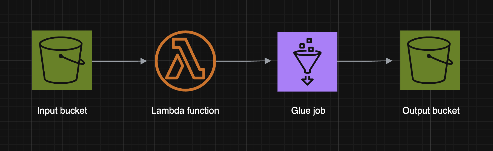

# AWS CSV to JSON Pipeline

## Project Description
This project demonstrates an **automated data pipeline on AWS** that converts CSV files uploaded to an S3 bucket into JSON files in another S3 bucket. The pipeline leverages **AWS Lambda** to trigger processing and **AWS Glue** to handle the data transformation.  

The main goal of this project is to showcase how cloud services can be integrated to automate data workflows efficiently, ensuring that raw data is transformed and stored in a format suitable for further processing or analysis.

---

## Architecture

  

**Pipeline flow:**
1. **Input S3 Bucket:** Users upload CSV files containing raw data.
2. **AWS Lambda:** A serverless function detects the upload event and triggers the Glue job.
3. **AWS Glue Job:** Transforms CSV data into JSON format, including any necessary schema adjustments or data cleaning.
4. **Output S3 Bucket:** Stores the transformed JSON files for further analysis or integration with other systems.

---

## Steps to Build the Pipeline

1. **Setup AWS S3 Buckets**
   - Create two S3 buckets: `input-bucket` for CSV uploads and `output-bucket` for storing JSON files.
   - Set up appropriate permissions to allow Lambda and Glue to access these buckets.

2. **Create AWS Glue Job**
   - Configure a Glue job with the necessary IAM role that has access to the S3 buckets.
   - Specify the data source as the input S3 bucket and the target as the output S3 bucket.
   - Define the transformation logic to convert CSV files to JSON format.
   - Test the Glue job independently to ensure it works as expected.

3. **Create AWS Lambda Function**
   - Write a Lambda function in Python to trigger the Glue job whenever a new CSV file is uploaded.
   - Attach the necessary IAM role to allow Lambda to start Glue jobs.
   - Example code snippet:
     ```python
     import boto3
     import json

     def lambda_handler(event, context):
         glue = boto3.client('glue')
         response = glue.start_job_run(JobName='your-glue-job-name')
         return {
             'statusCode': 200,
             'body': json.dumps('Glue job started successfully!')
         }
     ```
   - Deploy the Lambda function and set up a trigger for `s3:ObjectCreated:*` events on the input bucket.

4. **Testing the Pipeline**
   - Upload a sample CSV file to the input S3 bucket.
   - Confirm that the Lambda function is triggered automatically.
   - Verify that the Glue job runs successfully and the transformed JSON appears in the output S3 bucket.
---

## Technologies Used
- **AWS S3**: Object storage for raw and transformed data.
- **AWS Lambda**: Serverless function to trigger processing.
- **AWS Glue**: Managed ETL service to transform data.
- **Python (Boto3)**: Scripting for Lambda function.